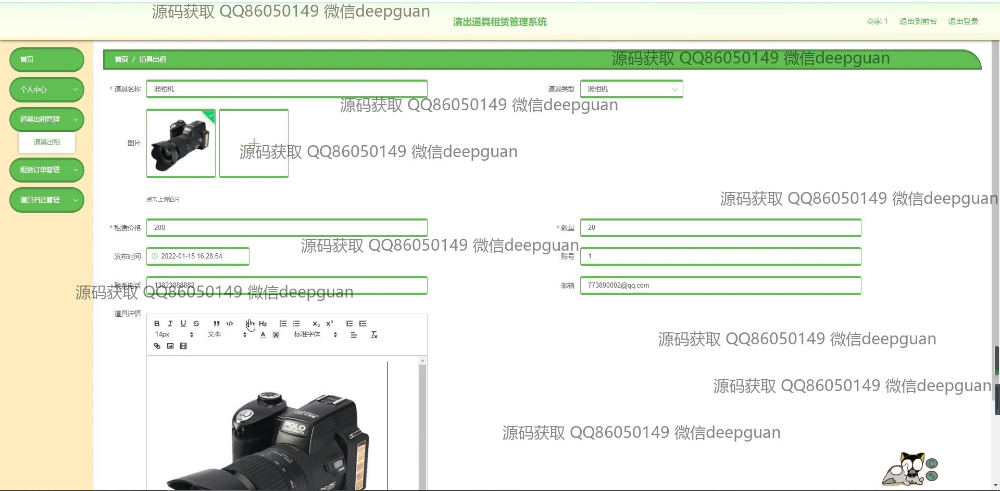
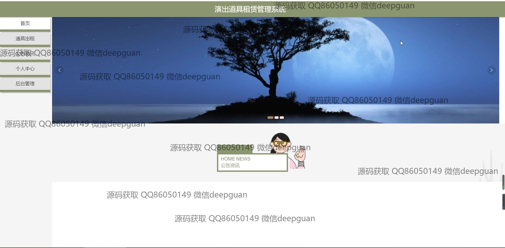

<h1 align="center">演出道具租赁管理系统</h1>

## 简介
演出道具租赁管理系统：角色分为管理员、用户；支持道具出租、租赁订单管理、道具库存管理、用户及商家管理、公告资讯发布等功能。    --计算机毕业设计源码；毕设源码；java毕业设计源码

## 联系方式

<h3 align="center">获取完整代码与数据库文件 + 微信：deepguan QQ: 86050149 QQ群: 783742310</h3>

<h3 align="center">可帮忙远程部署 包运行成功！提供远程部署、修改代码、设计文档指导、代码讲解等服务！</h3>

## 功能介绍（完整见运行截图）
管理员：登录、注册、退出功能；管理首页轮播图、公告资讯和用户反馈；后台管理模块包括用户管理、商家管理、道具类型管理、道具出借管理、租赁订单管理、道具归还管理以及系统设置；支持密码修改、数据统计和搜索优化功能。

商家：注册、登录和个人信息管理；发布、编辑和删除道具信息，包含上传图片、填写租赁价格、库存和联系方式；管理租赁申请和订单状态；查看和回复用户评论；统计租赁收入及道具使用情况。

用户：注册、登录和个人信息修改；浏览首页推荐道具和公告资讯；搜索、查看道具详情并提交租赁申请；管理租赁订单，包括查看订单状态、归还说明及评价；收藏道具和浏览租赁历史。

游客：访问首页查看公告资讯和推荐道具；浏览道具信息和商家简介；通过注册成为用户以解锁更多功能。

## 运行截图

本代码来源于网络,仅供学习参考使用!

